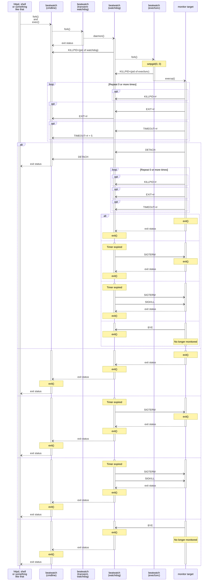

```
usage: beatwatch [OPTION]... [--] COMMAND [ARG]...
options:
  --ctrl-fd <N>    If this option is used, <N> is used for control file
                   descriptor number. Using this option without <N>, or
                   this option is not used at all, 3 is used for it.

  --ctrl-log <F>   If this option is used, control log is appended to
                   a file named <F>. Using this option without <F>,
                   "ctrl.log" is used as the file name.

  --debug          Enabe debug mode.

  --on-exit <S>    If this option is used, script <S> is executed by
                   /bin/sh. At the time before the script is executed,
                   the exit status of beatwatch (watchdog) is set to the
                   $? shell variable.

  --help, --usage  Display this help and exit.
```


